  

# 🆔 Awesome-SSI-Decentralized-Identity

  
  
  
  
  
  
  

---

## 🌟 Top Decentralized Identity (SSI) Ecosystem &amp; Developer Directory
> **A curated showcase of premier SaaS platforms, developer SDKs, EUDI wallets, and open-source frameworks for Self-Sovereign Identity (SSI), Verifiable Credentials (VCs), and Decentralized Identifiers (DIDs).**  
> *SEO Keywords: Self-Sovereign Identity, Decentralized Identity, SSI, Verifiable Credentials, W3C DIDs, EUDI Wallet, eIDAS 2.0, OpenID4VC, SD-JWT, AnonCreds, Zero-Knowledge Proofs, Decentralized Web.*  
> 📅 **Last updated: August 2026**

---

## 📑 Table of Contents
- [📖 Overview &amp; Key Concepts](#-overview--key-concepts)
- [☁️ SaaS &amp; Hosted SSI Platforms](#️-saas--hosted-ssi-platforms)
- [💻 Top Open-Source GitHub Projects](#-top-open-source-github-projects)
- [🏗️ Architectural Reference Stacks](#️-architectural-reference-stacks)
- [📈 Star History](#-star-history)
- [🤝 How to Contribute](#-how-to-contribute)
- [⚠️ Disclaimer](#️-disclaimer)

---

## 📖 Overview &amp; Key Concepts

**Self-Sovereign Identity (SSI)** empowers individuals and organizations to generate, own, and control their digital identifiers (**DIDs**) and cryptographically secure **Verifiable Credentials (VCs)** without dependency on centralized identity providers or single points of failure.

* 🔑 **Decentralized Identifiers (DIDs)**: Globally unique, resolvable identifiers without a central registration authority (e.g., `did:jwk`, `did:web`, `did:key`, `did:cheqd`, `did:dht`).
* 📜 **Verifiable Credentials (VCs)**: Tamper-proof, cryptographically signed claims issued by trusted entities (W3C VC Data Model 2.0, SD-JWT VC, ISO/IEC 18013-5 mDoc).
* 🛡️ **Zero-Knowledge Proofs (ZKP)**: Selective disclosure and cryptographic proofs without leaking underlying raw personal attributes (AnonCreds, BBS+ signatures).
* 📱 **Identity Wallets**: Edge-native holder software to store private keys, manage credentials, and facilitate authenticated presentation requests via OpenID for Verifiable Presentations (OID4VP).
* 🇪🇺 **EUDI &amp; eIDAS 2.0 Alignment**: Large-scale cross-border digital identity wallet standards across European and global regulated sectors.

---

## ☁️ SaaS &amp; Hosted SSI Platforms

> 📊 **Market Overview &amp; Fragmentation**: The global Decentralized Identity (SSI) market is currently valued at **$1.8B – $2.5B in 2026** and is projected to expand beyond **$15.0B by 2030** (~68% CAGR). The sector is **moderately to highly fragmented** rather than a winner-take-all monopoly, owing to jurisdiction-specific digital wallet frameworks (such as the European Union's EUDI / eIDAS 2.0 mandate), domain-specific compliance requirements (KYC/AML, healthcare, education), and diverse interoperability protocols (OpenID4VC, Aries, mDoc, SD-JWT).

The following table lists leading commercial and hosted SSI platforms, sorted by **Company Scale (Valuation / Revenue / Funding)** in descending order:

| Platform / Product | Company Scale (Valuation / Funding / Revenue) | Description &amp; Focus | Starting Tier Price | Free Tier / Free Trial Limits |
| :--- | :--- | :--- | :--- | :--- |
| **[Validated ID (VIDsigner)](https://www.validatedid.com/)** | **€70M+ Group Valuation** (~$6.8M Rev; Acquired by Signaturit Group / PSG Equity) | Qualified Trust Service Provider (QTSP) delivering eIDAS-compliant verifiable credentials and digital signature workflows. | **€20 / month per user** (Business plan with 5 advanced signature credits/month) | **14-day free trial** (Full Business tier features with 5 signature credits, no credit card required). |
| **[Affinidi](https://www.affinidi.com/)** | **Backed by Temasek** (Singapore State Fund, >$280B AUM; ~$5M–$10M Est. Rev) | Enterprise decentralized identity and consent-driven data-exchange platform with developer SDKs and Affinidi Login. | **$199 / month** (Developer / Pro tier with bundled Affinidi Credit packages) | **Free Essential Plan** (Forever free; starter allocation of Affinidi Credits and MAU allowance for testing). |
| **[cheqd Studio](https://cheqd.io/)** | **$42.6M Network Token Valuation** (~$3.3M Seed Funding Raised) | Decentralized payment and trust rails for verifiable credentials, custom DID methods, and credential monetization. | **~$2.00 / DID write** (Mainnet DID write ~$2.00, update ~$1.00, resources ~$0.10–$0.40 in $CHEQ) | **Free Testnet Tier** (Forever free unlimited DID creation, registration, and credential writes on testnet). |
| **[Trinsic](https://trinsic.id/)** | **$13.7M Total Funding** (Georgian, Founders Fund; ~$2.5M Est. Rev) | Reusable identity acceptance network &amp; developer infrastructure for issuing, verifying, and accepting credentials across products. | **$99 / month** (Growth plan with 1,000 credential transactions included; or ~$1.50/verification) | **Free Developer Plan** (Forever free; up to 100 credentials/month with Mock Providers &amp; Tester Network). |
| **[Sphereon](https://sphereon.com/)** | **~$8.3M Total Capital Raised** (Venture &amp; EU Innovation Grants; ~$2.0M Est. Rev) | Enterprise SSI &amp; Verifiable Data Exchange (VDX) platform, agent orchestration, and modular wallet SDKs. | **€500 / month** (Starter enterprise pilot &amp; verifiable data exchange API package) | **Free Forever Wallet App &amp; Demo Portal** (Unlimited credential storage in wallet apps and full access to sandbox demo). |
| **[Lissi](https://www.lissi.id/)** | **~€4.0M (~$4.3M) Funding** (Acquired by neosfer / Commerzbank Innovation Unit) | Turnkey European Digital Identity (EUDI) Wallet connector and enterprise SSI interaction platform. | **€1,500 / month** (Starter Program pilot package for EUDI Wallet &amp; eIDAS 2.0 integration) | **30-day interactive pilot trial** (Includes sandbox environment, test credentials, and SDK integration access). |
| **[Dock Labs (Truvera)](https://www.dock.io/)** | **~$3.2M Annual Revenue** (Bootstrapped &amp; Decentralized Token Ecosystem) | Turnkey verifiable credential platform &amp; APIs for issuing, verifying, and building reusable identity and KYC workflows. | **$499 / month** (Build plan for PoC, pilot, and starter production) | **30-day free trial** with unlimited credential issuance &amp; verification in test sandbox. |
| **[walt.id Enterprise](https://walt.id/)** | **~$1.2M Annual Revenue** (Bootstrapped &amp; Seed Venture Backed) | Enterprise-grade managed cloud &amp; turnkey SSI infrastructure with high availability clustering and SLA support. | **€2,500 / month** (Enterprise Managed Cloud/SaaS with clustering, multi-tenancy &amp; enterprise support) | **Free Community Stack** (Forever free self-hosted open-source core with unlimited DIDs/VCs; 14-day cloud trial). |
| **[Paradym (by Animo)](https://paradym.id/)** | **~$1.0M Annual Revenue** (Seed Venture Backed) | Developer platform built on Credo/Aries &amp; OpenID4VC for issuing, requesting, and verifying verifiable credentials. | **€50 / month** (Builder plan including 2,000 transactions/month; €0.033 per extra transaction) | **Free Community Plan** (Forever free; 100 transactions/month with full OpenID4VC &amp; AnonCreds support). |
| **[Danube Tech (Godiddy)](https://godiddy.com/)** | **~$0.8M Annual Revenue** (Bootstrapped &amp; EU Horizon Grant Recipient) | Cloud SSI services providing Universal Resolver, Registrar, and DID/VC management infrastructure. | **€60 / month** (T1 tier including 2,000 transactions/month; €0.03 per extra transaction) | **Free Tier** (Forever free; max 10 requests/30 mins, 5 total testnet DID writes, 2 DIDs/month). |

---

## 💻 Top Open-Source GitHub Projects

The following list contains prominent open-source repositories powering decentralized identity, sorted by **GitHub Star Count (Descending)**:

| Repository / Project | Github_Stars | Focus &amp; Core Capabilities |
| :--- | :--- | :--- |
| **[Hyperledger Indy Node](https://github.com/hyperledger/indy-node)** |  | Server codebase for decentralized, purpose-built distributed identity ledgers with privacy-by-design. |
| **[Hyperledger Indy SDK](https://github.com/hyperledger/indy-sdk)** |  | Official client SDK for creating, managing, and interacting with self-sovereign digital identities and verifiable credentials. |
| **[Universal Resolver](https://github.com/decentralized-identity/universal-resolver)** |  | DIF's central resolution engine and drivers for resolving DIDs across 50+ decentralized identity methods. |
| **[Veramo](https://github.com/decentralized-identity/veramo)** |  | Modular JavaScript/TypeScript framework for DIDs, verifiable credentials, messaging, and custom agent-based SSI architectures. |
| **[Hyperledger Aries / ACA-Py](https://github.com/openwallet-foundation/acapy)** |  | Aries Cloud Agent Python, the foundational server-side agent framework for enterprise SSI issuers, verifiers, and mediators. |
| **[DIF Sidetree](https://github.com/decentralized-identity/sidetree)** |  | Scalable layer-2 decentralized identifier (DID) protocol specification and reference implementation for high-throughput ledgers. |
| **[Blockcerts Cert-Issuer](https://github.com/blockchain-certificates/cert-issuer)** |  | Open standard originated at MIT Media Lab for issuing verifiable certificates on Bitcoin and Ethereum blockchains. |
| **[DID-JWT](https://github.com/decentralized-identity/did-jwt)** |  | Universal library for signing and verifying JSON Web Tokens (JWT) using Decentralized Identifiers (DIDs). |
| **[Credo (credo-ts)](https://github.com/openwallet-foundation/credo-ts)** |  | Pure TypeScript framework under OpenWallet Foundation for building SSI agents, wallets, and mediators compatible with Aries and OpenID4VC. |
| **[walt.id Identity Stack](https://github.com/walt-id/waltid-identity)** |  | Open-source Kotlin &amp; TypeScript stack for end-to-end digital identity, cloud wallets, credential issuance, and EU Digital Identity Wallet flows. |
| **[uPort Ethr-DID](https://github.com/uport-project/ethr-did)** |  | Ethereum DID method (`did:ethr`) library for identity resolution and key management on EVM-compatible blockchains. |
| **[Hyperledger Aries Framework Go](https://github.com/hyperledger/aries-framework-go)** |  | Go framework for secure, decentralized peer-to-peer interactions, verifiable credentials, and DID management. |
| **[DID Resolver](https://github.com/decentralized-identity/did-resolver)** |  | Lightweight JavaScript library for resolving DID documents across different DID driver implementations. |
| **[Bifold Mobile Wallet](https://github.com/openwallet-foundation/bifold-wallet)** |  | Production-ready React Native digital identity wallet for holding and presenting verifiable credentials, managed by OpenWallet Foundation. |
| **[TBD Web5 JS SDK](https://github.com/TBD54566975/web5-js)** |  | Web5 SDK for building decentralized web apps with DIDs (`did:dht`, `did:jwk`, `did:ion`), Verifiable Credentials, and Decentralized Web Nodes (DWNs). |
| **[Hyperledger Identus](https://github.com/hyperledger-identus/identus)** |  | LF Decentralized Trust project providing cloud agent, mediator, edge SDKs, and components for standards-based enterprise SSI. |
| **[AnonCreds Rust](https://github.com/hyperledger/anoncreds-rs)** |  | High-performance Rust implementation of privacy-preserving Zero-Knowledge Anonymous Credentials (AnonCreds v1.0). |
| **[Sphereon SSI SDK](https://github.com/Sphereon-Opensource/SSI-SDK)** |  | Open-source TypeScript SDK for W3C Verifiable Credentials, OpenID for Verifiable Credential Issuance (OID4VCI), and Verification (OID4VP). |

---

## 🏗️ Architectural Reference Stacks

When architecting a production-grade SSI system, consider combining standard components:

1. **Issuer / Verifier Agent**: Build with **[Credo](https://github.com/openwallet-foundation/credo-ts)** (TypeScript), **[ACA-Py](https://github.com/openwallet-foundation/acapy)** (Python), or **[walt.id](https://github.com/walt-id/waltid-identity)** (Kotlin/Java).
2. **Holder Mobile Application**: Leverage **[Bifold](https://github.com/openwallet-foundation/bifold-wallet)** (React Native) or embed wallet SDKs (OpenWallet Foundation / walt.id).
3. **DID Resolution &amp; Trust Registry**: Integrate **[Universal Resolver](https://github.com/decentralized-identity/universal-resolver)** alongside domain-bound DIDs (`did:web`, `did:jwk`) or ledger-anchored DIDs (`did:cheqd`, `did:ethr`).
4. **Credential Protocols**: Implement **OpenID4VCI** (Issuance) and **OpenID4VP** (Presentation) with **SD-JWT VC** or **W3C VC 2.0** for seamless EU EUDI Wallet compliance.

---

## 📈 Star History

---

## 🤝 How to Contribute
1. 🍴 Fork the repository.
2. 📝 Add or update entries in `README.md` keeping descriptions factual, concise, and linking to official sources.
3. 🚀 Ensure proper categorization, transparent pricing details, and star badges for open-source repos.
4. 📬 Submit a Pull Request with a short summary of the updates.

⭐ **Star the repo** if you find it helpful for your decentralized identity journey!

---

## ⚠️ Disclaimer
* This is a **community-curated** list for informational and architectural evaluation purposes — not an endorsement.
* Decentralized identity involves advanced cryptography, key custody, and regulated credential frameworks (e.g., government eID, KYC). Ensure rigorous security reviews, recovery mechanisms, and compliance checks for your jurisdiction.
* This repository does not provide legal or compliance advice.

---

  <b>Built with ❤️ for identity architects, wallet builders, and developers shaping the decentralized future.</b>

